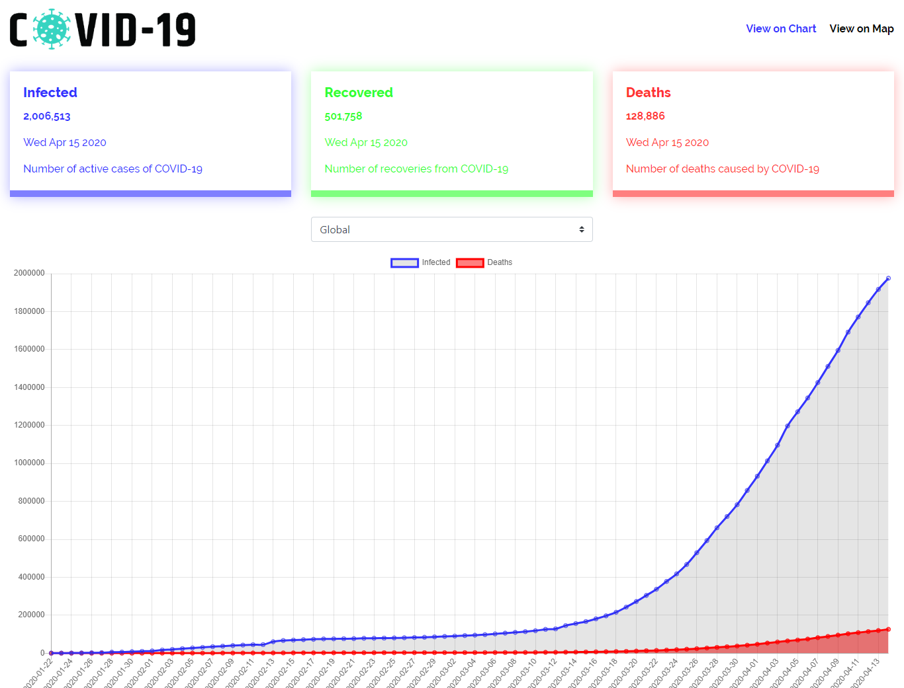

<h1 align="center">Welcome to COVID-19-Tracker-APP 👋</h1>

> COVID-19-Tracker using React React-Chart React-Bootstrap and Mapbox

- ✨ [Demo](https://covid-19-info-app.netlify.app/)

## Getting Started
These instructions will get you a copy of the project up and running on your local machine for development purposes.

##Prerequisites
What things you need to install the software and how to install them

You need to have a MapBox account to get Key API for free


## Usage

```sh
npm install && npm start
```

## Demo

Final result



## Tech

- [React](https://create-react-app.dev/)
- [React-Chart](https://www.npmjs.com/package/react-chartjs-2)
- [React-Bootstrap](https://react-bootstrap.github.io/)
- [Mapbox](https://www.mapbox.com/)

## Author

👤 **Rahul Dutta**


Thanks 🙏
